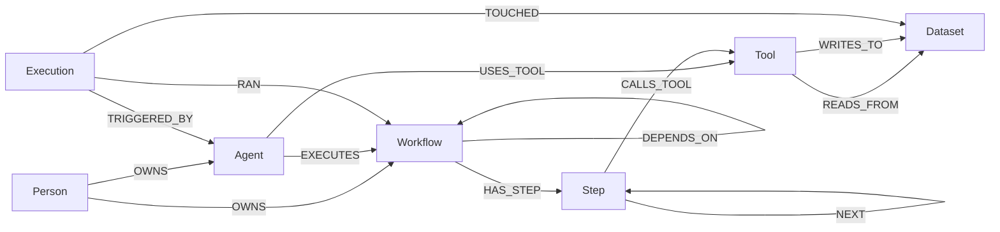
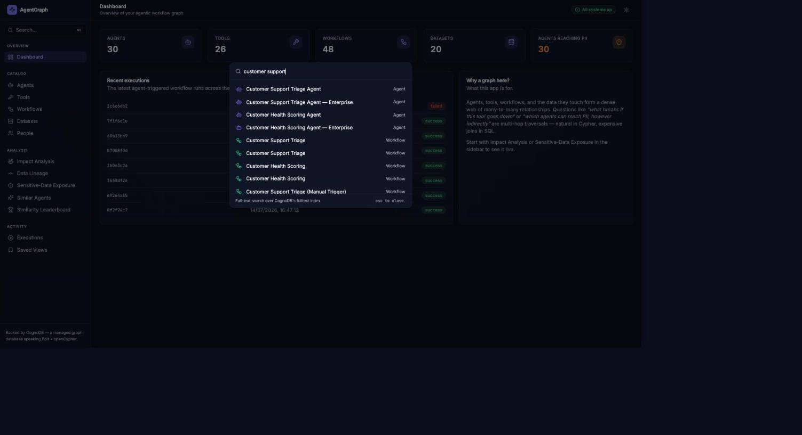
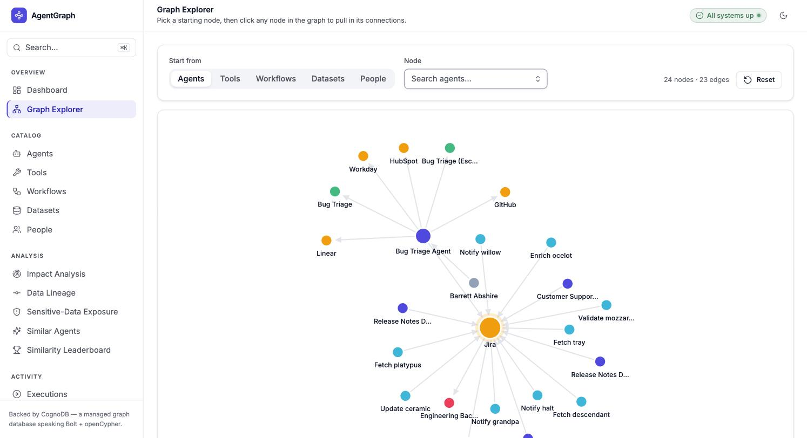
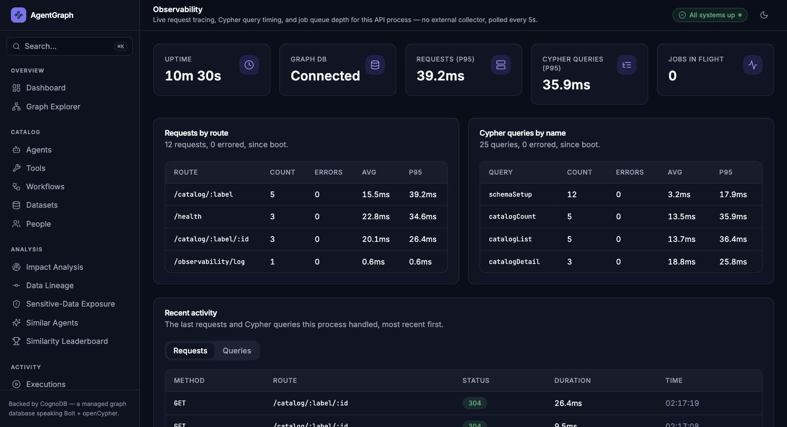
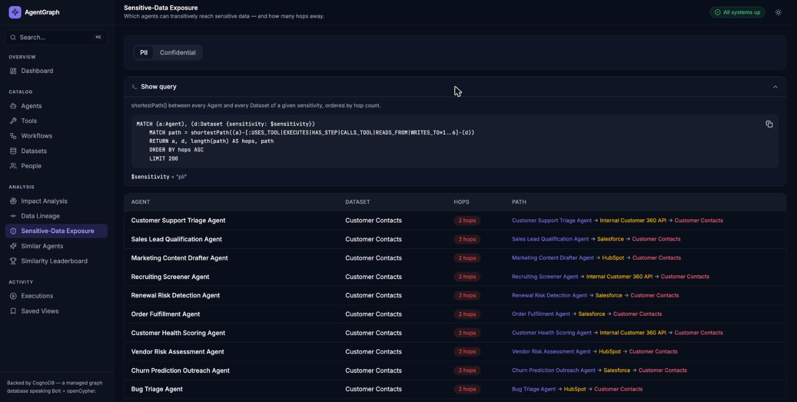

# AgentGraph

[](https://github.com/Subramanyarao11/agentgraph/actions/workflows/ci.yml)

**Agentic workflow impact & lineage intelligence — backed by [CognoDB](https://console.cognodb.com), a managed graph database.**

AgentGraph models a company's AI agents, the tools they call (Slack, Jira, Salesforce, internal APIs, …), the multi-step workflows those agents run, and the datasets that flow through them — as a graph. It answers the questions that actually matter once an org has more than a handful of automations running: *if this integration goes down, what breaks? Which agents can reach PII, however indirectly? What's this agent's real data lineage?*

> Take-home assignment for Wexa AI. Built as a pnpm monorepo: NestJS + Zod + TypeORM API, TanStack Start + TanStack Query + shadcn/ui + Framer Motion frontend, CognoDB (Neo4j-protocol-compatible) as the graph store, Postgres for app metadata, Redis/BullMQ for background analysis jobs.

---

## Contents

- [Why a graph database?](#why-a-graph-database)
- [The data model](#the-data-model)
- [Architecture](#architecture)
- [Observability](#observability)
- [Setup](#setup)
- [The queries, explained](#the-queries-explained)
- [Frontend engineering](#frontend-engineering)
- [Testing & CI](#testing--ci)
- [Project structure](#project-structure)
- [Screenshots](#screenshots)

---

## Why a graph database?

The interesting questions in this domain are all about **paths and reachability through many-to-many relationships**, not rows:

- **"If this Tool goes down, what breaks?"** — an Agent can use a Tool directly, or a Workflow can call it three steps deep. Answering this in SQL means recursively joining `agents ⋈ agent_tools ⋈ tools`, `steps ⋈ step_tools`, `workflows ⋈ steps`, `agents ⋈ workflows` — a different shape of join per hop, with no fixed depth. In Cypher it's one variable-length pattern: `(tool)<-[:USES_TOOL|CALLS_TOOL|HAS_STEP*1..4]-(affected)`.
- **"Which agents can reach PII data, however indirectly?"** — transitive reachability through a chain of relationship *types* (an agent uses a tool, which writes to a dataset; or a workflow's step calls a tool that reads a different dataset). This is exactly what a relational engine is bad at: unbounded-depth traversal needs a recursive CTE per query, re-written whenever the relationship shape changes. It's a native graph pattern match here.
- **"Which agents are similar to this one?"** (by shared tool usage) — a self-join through a many-to-many bridge table (`agent_tools`), grouped and normalized. Doable in SQL, but the query reads like a graph traversal even when written in SQL — because it *is* one.
- **Data lineage** (dataset → tool → step → workflow → agent) is a fixed 4-hop chain across four differently-shaped relationships. One `MATCH` pattern in Cypher; four sequential joins (or a recursive CTE, if step ordering is dynamic) in SQL.

None of this is artificial — it's the actual shape of an agent/tool/workflow dependency graph. A relational schema *can* represent it (foreign keys), but every one of the queries above degrades from "one pattern" to "N joins, where N depends on how deep the incident goes" — which is precisely the class of problem graph databases exist to solve.

## The data model



| Label | Key properties |
|---|---|
| `Person` | name, email, team, title |
| `Agent` | name, role, status, autonomyLevel |
| `Tool` | name, vendor, category, authType, riskLevel |
| `Workflow` | name, trigger, status |
| `Step` | name, type (action/condition/loop/approval), order |
| `Dataset` | name, system, sensitivity (public/internal/confidential/**pii**) |
| `Execution` | status, startedAt, finishedAt, durationMs |

Relationship properties: `USES_TOOL.criticality` (core/optional), `EXECUTES.role` (primary/fallback), `TOUCHED.access` (read/write), etc. Full Zod schemas — the single source of truth for every node and relationship shape — live in [`packages/graph-schema`](./packages/graph-schema).

Seed data (`pnpm seed`) generates ~22 people, ~32 agents across 20 realistic roles, a fixed catalog of 26 tools (Slack, Salesforce, Jira, Stripe, Okta, Snowflake, …) and 20 datasets with an intentional sensitivity mix, ~40 workflows with 3–6 step chains each, and ~260 executions — a few thousand nodes/relationships total, comfortably inside CognoDB's free-tier limits while still producing non-trivial traversal results.

## Architecture

```
apps/
  api/    NestJS — Cypher via the official neo4j-driver, Postgres via TypeORM, BullMQ jobs
  web/    TanStack Start (React, SSR) — TanStack Query, shadcn/ui, Framer Motion
packages/
  graph-schema/   Zod schemas + TS types for every node/relationship — shared by api, web, seed
  graph-client/   Thin wrapper over neo4j-driver: parameterized queries only, connection lifecycle,
                  result mapping (Neo4j Node/Relationship/Path → plain DTOs), schema/constraints
```

**Why three data stores?** The graph (CognoDB/Neo4j) is the domain's source of truth — every Agent/Tool/Workflow/Dataset relationship lives there. Postgres (via TypeORM) holds *app-side* metadata that isn't part of the domain graph: saved analysis views (bookmarked queries a non-technical user can revisit). Redis/BullMQ runs the one genuinely expensive computation — all-pairs agent similarity across the whole graph (O(n²)) — as a background job instead of blocking a request, with the frontend polling job status through queued → running → complete.

**Engineering details worth walking through:**
- Every Cypher query is parameterized (`$param`) via the official `neo4j-driver`; see [`apps/api/src/analysis/analysis.queries.ts`](./apps/api/src/analysis/analysis.queries.ts) for the one documented exception (variable-length hop *bounds*, which Cypher requires as literal integers — Zod-validated to a `[1,6]` integer range before interpolation, never raw user input).
- `GraphExceptionFilter` maps an unreachable database to a `503` and a failed query to a `500`, instead of the API crashing or leaking a stack trace — the frontend shows a clear "couldn't load this" state either way.
- Zod schemas double as request-DTO validation (`ZodValidationPipe`) *and* the frontend's type source — one schema, no drift between what the API accepts and what the UI sends.

## Observability

Every request and every Cypher query is timed and correlated — visible live in the app at **Observability** in the sidebar, no external agent or collector to run:

- **`GraphClient.readQuery`/`writeQuery`** (`packages/graph-client/src/client.ts`) take an optional `name` — every call site in `analysis.service.ts`, `catalog.service.ts`, and `search.service.ts` passes one (`"impactList"`, `"catalogDetail"`, `"fulltextSearch"`, …) — and emit a `{ name, mode, durationMs, ok }` event through an `onQuery` hook after every execution, success or failure.
- **`RequestTracingInterceptor`** (global, `apps/api/src/common/interceptors/request-tracing.interceptor.ts`) times every HTTP request, tags it with a correlation ID (returned as `x-request-id`, echoing one the caller sent), and threads that ID through `AsyncLocalStorage` for the request's lifetime. `GraphService` wires its `onQuery` hook to read the current ID, so a slow query in the log can be traced back to the exact request that ran it.
- **`ObservabilityService`** keeps a bounded in-memory rolling window (500 entries) of both logs and computes count/error-rate/avg/p95 — overall and grouped by route or query name — with no external store; it's process-local by design, scoped to one instance's uptime, not a multi-instance-safe metrics backend.
- **`GET /observability/summary`** and **`GET /observability/log`** expose the aggregates and the raw recent-entry log; the frontend page polls both every 5s and renders them with the same Card/Table primitives used everywhere else in the app.

This is deliberately the lightweight version — no OpenTelemetry, no Jaeger/Grafana to stand up alongside the app — in keeping with the project's frictionless-to-run goal. A multi-instance deployment would swap `ObservabilityService`'s in-memory buffer for a shared store (Redis, or a real APM), but the request/query instrumentation points wouldn't need to change.

## Setup

### Prerequisites

- Node.js ≥ 20, [pnpm](https://pnpm.io) ≥ 9
- Docker (for local Neo4j/Postgres/Redis — see below)

### 1. Get a CognoDB instance (for the real deployment)

1. Sign up at [console.cognodb.com/signup](https://console.cognodb.com/signup) (no card required for the free tier).
2. Create a free **c0** instance, pick a region. Provisions in under a minute.
3. Copy the `bolt+s://<instance-id>.databases.cognodb.cloud` URI and the generated password for user `cognodb` — **the password is shown once**.

### 2. Local development (no CognoDB account needed)

CognoDB has no self-hostable image — it's cloud-only — but it speaks the same Bolt/Cypher wire protocol as Neo4j, so Neo4j is a drop-in local stand-in. This is why the app is runnable end-to-end without any external account:

```bash
git clone <this-repo>
cd graphdb
cp .env.example .env          # defaults already point at the docker-compose services below
docker compose up -d          # Neo4j (bolt://localhost:7687), Postgres, Redis
pnpm install
pnpm seed                     # loads realistic demo data into the graph
pnpm dev                      # API on :3001, web app on :3000
```

Open **http://localhost:3000**.

### 3. Pointing at real CognoDB Cloud

Edit `.env`:

```bash
GRAPH_URI=bolt+s://<instance-id>.databases.cognodb.cloud
GRAPH_USER=cognodb
GRAPH_PASSWORD=<the password you saved>
GRAPH_DATABASE=neo4j
```

No code changes — `pnpm seed && pnpm dev` again. The official `neo4j-driver` (used throughout `packages/graph-client`) connects to CognoDB unchanged.

### Useful scripts

| Command | What it does |
|---|---|
| `pnpm dev` | Runs the API and web app together (via Turborepo) |
| `pnpm seed` | Loads seed data (idempotent — adds on top of existing data) |
| `pnpm seed:reset` | Wipes the graph first, then reseeds |
| `pnpm build` | Builds every app/package |
| `pnpm typecheck` | Type-checks the whole monorepo |
| `pnpm test` | Runs unit tests across the monorepo |

## The queries, explained

All Cypher lives in one place — [`packages/graph-schema/src/cypher.ts`](./packages/graph-schema/src/cypher.ts) — shared by the API (which executes it) and the web app (which renders it verbatim in a "Show query" panel on every analysis page, so what you see on screen can't drift from what actually ran).

**1. Impact analysis (multi-hop, variable length)** — `/analysis/impact?nodeId=&maxHops=`
```cypher
MATCH (start {id: $nodeId})
MATCH path = (start)-[:USES_TOOL|EXECUTES|HAS_STEP|CALLS_TOOL|DEPENDS_ON|NEXT*1..N]-(affected)
WHERE (affected:Agent OR affected:Workflow) AND affected.id <> $nodeId
```
Blast radius from a failing Tool or Workflow: every Agent/Workflow within N hops, ranked by shortest distance.

**2. Data lineage (fixed 4-hop)** — `/analysis/lineage?datasetId=`
```cypher
MATCH path = (d:Dataset {id: $datasetId})<-[:READS_FROM|WRITES_TO]-(:Tool)
             <-[:CALLS_TOOL]-(:Step)<-[:HAS_STEP]-(:Workflow)<-[:EXECUTES]-(:Agent)
```
Everything that can produce or consume a dataset, traced back through the tool/step/workflow chain to the responsible agents.

**3. Agent similarity (the "awkward in SQL" one)** — `/analysis/similar-agents?agentId=`
```cypher
MATCH (a:Agent {id: $agentId})-[:USES_TOOL]->(t:Tool)
WITH a, collect(DISTINCT t) AS aTools, count(DISTINCT t) AS aToolCount
MATCH (other:Agent)-[:USES_TOOL]->(t2:Tool)
WHERE other.id <> a.id AND t2 IN aTools
WITH other, aToolCount, collect(DISTINCT t2.name) AS sharedToolNames, count(DISTINCT t2) AS sharedTools
RETURN other, sharedToolNames, sharedTools, toFloat(sharedTools) / aToolCount AS score
```
A Jaccard-style recommendation by shared tool usage.

**4. Sensitive-data exposure** — `/analysis/exposure?sensitivity=pii`
```cypher
MATCH (a:Agent), (d:Dataset {sensitivity: $sensitivity})
MATCH path = shortestPath((a)-[:USES_TOOL|EXECUTES|HAS_STEP|CALLS_TOOL|READS_FROM|WRITES_TO*1..6]-(d))
```
Every agent that can transitively reach PII/confidential data, with the shortest path shown — a governance question that's pure reachability.

**5. Execution trace** — `/analysis/executions/:id/trace` — which agent triggered a run, which workflow it ran, and which datasets it touched, with read/write access.

**6. Global full-text search** (⌘K) — `/search?q=`
```cypher
CALL db.index.fulltext.queryNodes("agentgraphSearch", $term + "*")
YIELD node, score
RETURN node, score ORDER BY score DESC LIMIT 10
```
Search terms are escaped against Lucene's special-character syntax before being passed as a parameter (see `escapeLuceneTerm` in [`apps/api/src/search/search.service.ts`](./apps/api/src/search/search.service.ts)) — this is the one CognoDB headline feature (fulltext indexing) the rest of the app doesn't otherwise exercise.

## Frontend engineering

- **Route-level code splitting.** Every route is split into a plain file (`analysis.impact.tsx`, registers the path) and a `.lazy.tsx` sibling (the actual component + its imports), TanStack Router's supported convention for this. Verified against the real build output, not assumed — `vite build` emits a separate ~2–4KB chunk per route, fetched only on navigation (confirmed via the network tab: visiting `/analysis/impact` fetches `analysis.impact.lazy-*.js` and nothing else).
- **Error boundaries.** The root route sets `errorComponent` (catches a render/loader throw from any matched route without unmounting the sidebar), `notFoundComponent` (bad URLs, thrown `notFound()`), and `pendingComponent` (a thin top-of-viewport progress bar during route-chunk fetches, `pendingMs: 150` so it doesn't flash on fast transitions). A crash in one page no longer white-screens the app.
- **Skeletons that mirror real layout.** `components/skeletons.tsx` has one skeleton shape per layout pattern used across the app (`TableSkeleton`, `CardGridSkeleton`, `ListSkeleton`, `StatTilesSkeleton`) so the loading state has the same column count / card shape as the loaded content — no layout shift when data arrives.
- **One motion system, not per-component ad hoc animation.** `components/motion.tsx` defines the app's entire animation vocabulary — `FadeIn`, `StaggerGroup`/`StaggerItem`, one easing curve, one duration scale — used consistently for page entrances, list/table row reveals, and dialog/dropdown transitions. `MotionConfig reducedMotion="user"` at the root means every animation degrades to opacity-only for users with reduced-motion preferences, automatically.
- **Dark mode was silently broken, then fixed properly.** `app.css` originally had an explicit `[data-theme="dark"]` override but no `prefers-color-scheme` fallback, so the app was permanently light regardless of OS setting. Rebuilt as a proper cascade (system preference → explicit user override, toggle persisted to `localStorage`) with a pre-hydration inline script so there's no flash of the wrong theme on load.
- **Two Radix-based UI primitives (`Select`, `Separator`) were dead code** — built early, never actually wired into any page. Confirmed via `grep` before deleting, along with their now-unused `@radix-ui/*` dependencies, rather than leaving unused components for a reviewer to wonder about.
- **One dialog animation was silently inert.** The shared `Dialog` component referenced `tailwindcss-animate` utility classes (`animate-in`, `fade-in-0`) from a plugin that was never installed — Tailwind treats unknown utilities as a no-op, so the dialog had been opening with zero transition. Replaced with manual `data-[state=]`-driven transitions (verified working) across `Dialog`, the command palette, and `Tooltip`.
- **Accessibility pass.** `NodePicker` and the command palette (⌘K) are full ARIA comboboxes — `role="combobox"`, `aria-expanded`/`aria-controls`/`aria-activedescendant`, arrow-key + Enter/Escape navigation, `role="listbox"`/`option` results — not mouse-only dropdowns. Async status (job polling, health indicator, live counts) is exposed via `aria-live`/`role="status"`/`role="alert"` regions instead of only a visual change. Every decorative icon is `aria-hidden`, every icon-only button has an `aria-label`, and every form control has a real `<label htmlFor>` pairing. One acknowledged gap: the force-directed graph canvas (`GraphCanvas`) is SVG-rendered and mouse/pointer-only — full keyboard graph traversal was scoped out as a follow-up, not silently skipped.
- **Bundle size: LazyMotion over the full Framer Motion API.** Swapped `motion.div` for `m.div` + a root-level `LazyMotion features={domAnimation} strict`, which drops the animation engine to the ~15KB `domAnimation` feature set instead of the full `motion` bundle (no layout-projection support, which is the trade-off — one list, in Saved Views, was simplified from an animated `layout`/`popLayout` reorder to a plain mount/unmount transition to stay inside that budget). Measured via real `vite build` output, not assumed: main entry chunk dropped from 547.60 kB / 171.40 kB gzip to 505.58 kB / 159.28 kB gzip.
- **Hover-intent prefetching.** Sidebar nav links call `queryClient.prefetchQuery` on `onMouseEnter`, using the exact same `queryOptions()` (shared between the hook and the prefetch call, so the query key can't drift) that the destination route fetches on mount — by the time a click lands, the data is often already warm. `GraphCanvas`'s 260-tick force simulation is memoized on an id-based signature of the nodes/edges rather than array identity, since callers routinely pass freshly-mapped/`?? []` arrays on every render even when the underlying graph hasn't changed.
- **The graph canvas is actually interactive, not a static picture.** Scroll-to-zoom and drag-to-pan are hand-rolled with pointer/wheel events and SVG's `getScreenCTM()` for coordinate conversion — deliberately not d3-zoom/d3-drag, which fight React for DOM ownership and add real bundle weight for what's a few dozen lines of math. Individual nodes are draggable to declutter a busy layout. Edges are directed (SVG marker arrowheads, shortened to land on the target node's boundary, since this *is* a directed graph — USES_TOOL, EXECUTES, … — that previously showed no direction at all) with the relationship type as a native `<title>` tooltip. Hovering a node highlights it and its direct connections, dimming everything else. Caught a real bug building this: rapid zoom-button clicks computed each new scale from the same pre-render `transform` closure instead of the previous click's result, so several quick clicks only applied one step — fixed with functional `setState` updates.
- **Graph Explorer** (sidebar → Overview) — click-to-expand exploration of the whole graph, not just a single analysis's subgraph. Pick any starting node and its neighborhood loads; click any node in that neighborhood and its neighbors merge in too. No dedicated "give me everything" endpoint — it reuses `GET /catalog/:label/:id` (the same call the catalog detail page already makes) incrementally, accumulating nodes/edges in a `Map` keyed by id.
- **Contrast and hierarchy weren't assumed, they were measured.** Computed actual WCAG contrast ratios (relative-luminance formula, not eyeballed) for every foreground/background token pair and found real failures — `--warning` as text was 2.67:1 against white, `--muted-foreground` cleared the page background but not the `--secondary` surfaces it also sits on. Root cause matched a known anti-pattern: one accent shade doing double duty as both a badge/button fill and literal text color can't satisfy both. Split each into a fill token and a darker `-text` sibling, and added a proper three-tier text hierarchy (`--foreground` primary, a re-tuned `--muted-foreground` secondary, a new `--tertiary-foreground` for genuinely de-emphasized content like timestamps and IDs) instead of one shade doing every non-primary job in the app.
- **A UI polish pass against a real, sourced checklist**, not vibes — audited against [ibelick/ui-skills](https://github.com/ibelick/ui-skills)' playbook (30 concrete, checkable rules compiled from several named design-focused Claude Code skills). Found one real gap: Saved Views' delete fired the mutation off a single click with no way back — now gated behind a confirmation dialog. Smaller fixes applied broadly rather than per-instance where possible: icon stroke-width (lucide's 2px default reads heavy beside this app's mostly-regular-weight text — one CSS rule overrides it everywhere), `tabular-nums` on the shared Table/Badge components, icon state changes (theme toggle, copy-confirm, health status) cross-fading instead of snapping.

## Testing & CI

```bash
pnpm test          # unit tests across the monorepo (turbo run test)
```

Tests are unit-level and DB-free by design — no live Neo4j/CognoDB, Postgres, or Redis needed to run them, which keeps CI fast and makes them safe to run against either backend without provisioning anything:

- [`packages/graph-client/src/mapping.test.ts`](./packages/graph-client/src/mapping.test.ts) — Bolt Integer/Node/Relationship/Path → DTO mapping, built against real `neo4j-driver` fixture objects (`new neo4j.Node(...)`, `new neo4j.Path(...)`), not hand-rolled mocks of the driver's shape.
- [`packages/graph-client/src/schema.test.ts`](./packages/graph-client/src/schema.test.ts) — verifies `applyGraphSchema` keeps applying remaining constraints/indexes after one is rejected, instead of throwing (the CognoDB-DDL-compatibility safety net described above).
- [`apps/api/src/catalog/catalog.service.test.ts`](./apps/api/src/catalog/catalog.service.test.ts) — asserts `limit`/`offset` are sent as Bolt Integers, not floats (the exact bug this caught during development — Neo4j's `SKIP`/`LIMIT` reject `'2.0'`).
- [`apps/api/src/search/search.service.test.ts`](./apps/api/src/search/search.service.test.ts) — Lucene special-character escaping.
- [`apps/api/src/common/pipes/zod-validation.pipe.test.ts`](./apps/api/src/common/pipes/zod-validation.pipe.test.ts) — coercion, defaults, and rejection behavior at the request-validation boundary.

GitHub Actions ([`.github/workflows/ci.yml`](./.github/workflows/ci.yml)) runs `typecheck` → `lint` → `build` → `test` on every push and PR to `main`. Lint is ESLint 9 flat config (`typescript-eslint` + `eslint-plugin-react-hooks` for the web app) — not present for most of this project's history; added along with fixing the two real issues it caught (a dead `let deleted = 0` initializer in the seed script's reset loop, an unused test parameter) and a deliberate downgrade of `react-hooks/set-state-in-effect` to a warning, documented inline in `apps/web/eslint.config.mjs`, for two effects that are genuinely synchronizing with an external system (SSR-safe theme hydration, incremental graph-explorer merge) rather than deriving state the rule assumes belongs in render.

## Project structure

```
graphdb/
├── apps/
│   ├── api/                  NestJS API
│   │   └── src/
│   │       ├── analysis/     the 5 graph-native queries above
│   │       ├── catalog/      generic list/detail over any node label
│   │       ├── graph/        GraphService — GraphClient lifecycle, health
│   │       ├── jobs/         BullMQ: async similarity leaderboard
│   │       ├── views/        Postgres/TypeORM: saved analysis views
│   │       ├── search/       full-text search (⌘K), CognoDB's fulltext index
│   │       ├── health/       aggregate graph+postgres+redis health
│   │       ├── config/       Zod-validated env config
│   │       └── seed/         seed data generator + batched graph loader
│   └── web/                  TanStack Start frontend
│       └── src/
│           ├── routes/       one file per page (file-based routing), each split into a
│           │                 plain file + a .lazy.tsx sibling for route-level code splitting
│           ├── components/   ui/ (shadcn primitives), graph/ (force-directed SVG viz), layout/,
│           │                 command-palette.tsx (⌘K), cypher-panel.tsx ("Show query"),
│           │                 motion.tsx (the app's one animation system), skeletons.tsx,
│           │                 route-error-boundary.tsx / route-not-found.tsx / route-pending.tsx
│           └── hooks/        TanStack Query hooks, one per API area
├── packages/
│   ├── graph-schema/         Zod schemas + TS types (the domain model) + cypher.ts (shared queries)
│   └── graph-client/         neo4j-driver wrapper — the only file importing it directly
├── .github/workflows/ci.yml  typecheck → lint → build → test on every push/PR
└── docker-compose.yml        local Neo4j + Postgres + Redis
```

## Screenshots

| | |
|---|---|
|  Dashboard |  Sensitive-data exposure |
|  Similar agents |  Similarity leaderboard (async job) |
|  Node detail — 1-hop neighborhood graph |  Global full-text search (⌘K) |
|  Graph Explorer — click any node to pull in its connections |  Observability, dark mode — live request/query timing |
|  "Show query" panel, dark mode | |

## Deploying (Render)

`render.yaml` at the repo root is a [Render Blueprint](https://render.com/docs/blueprint-spec) that provisions the API, the web app, a managed Postgres, and a managed Redis from Dockerfiles — everything except the graph database itself.

1. Push this repo to GitHub (already done if you're reading this on GitHub).
2. In the [Render dashboard](https://dashboard.render.com), **New → Blueprint**, select this repo.
3. Render will prompt for the values marked `sync: false` in `render.yaml`: `GRAPH_URI` and `GRAPH_PASSWORD` from your CognoDB Cloud instance (see [Setup](#setup) above).
4. Deploy. Once both services are up, check the actual assigned URLs — if they differ from `agentgraph-api.onrender.com` / `agentgraph-web.onrender.com` (Render service names are globally unique, so a generic name may already be taken), update the `CORS_ORIGIN` env var on the API service and the `VITE_API_URL` env var on the web service (Render auto-passes it through as a Docker build arg — see the comment in `render.yaml`), then trigger a redeploy of both.
5. Run the seed script once against the deployed CognoDB instance (`pnpm seed`, with your local `.env` pointed at the same CognoDB URI) so the hosted demo has data.

## Demo

- **Hosted app:** _TODO — add link_
- **Screen recording:** _TODO — add link_
