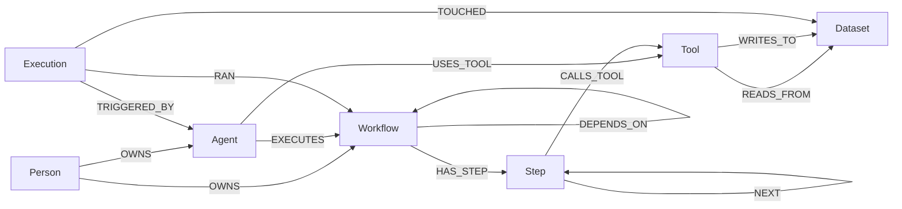
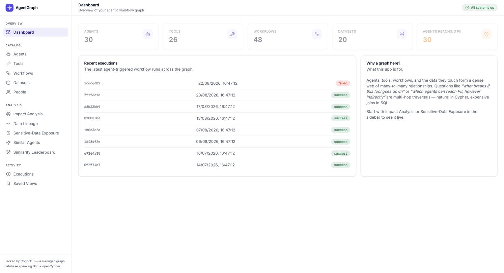
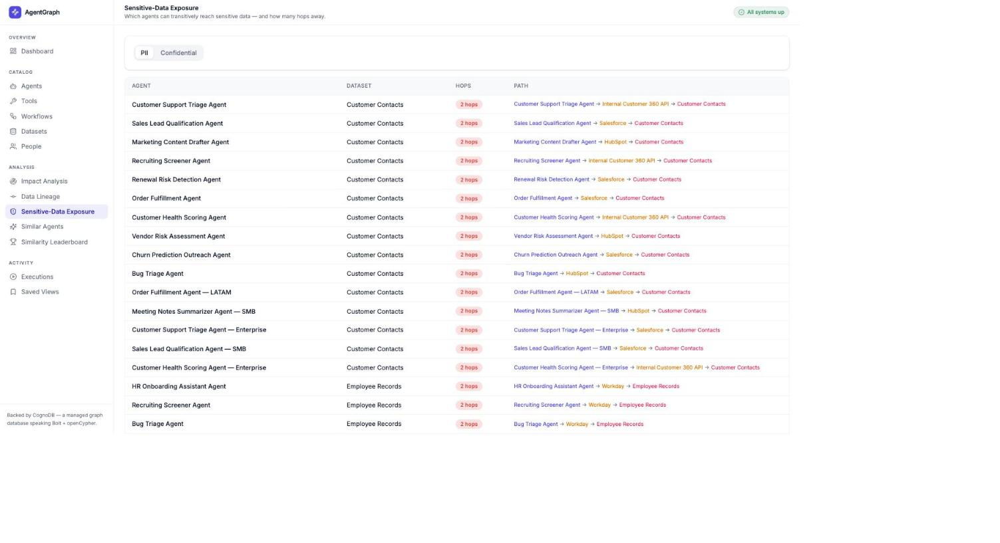
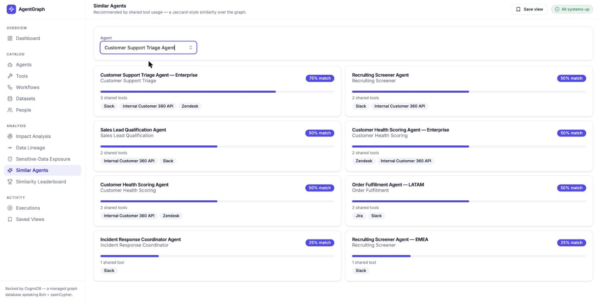
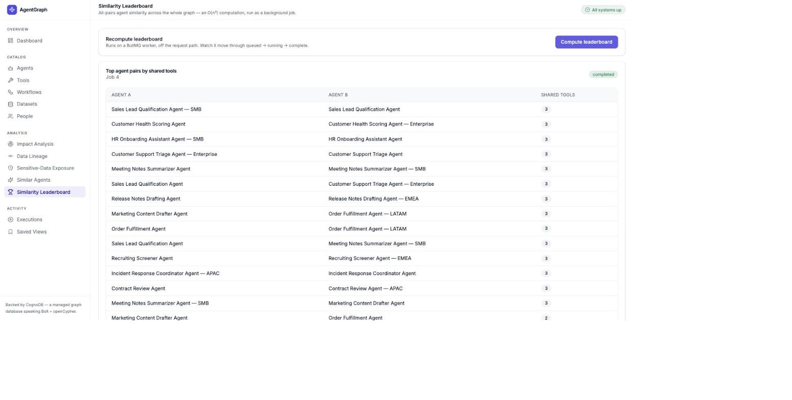
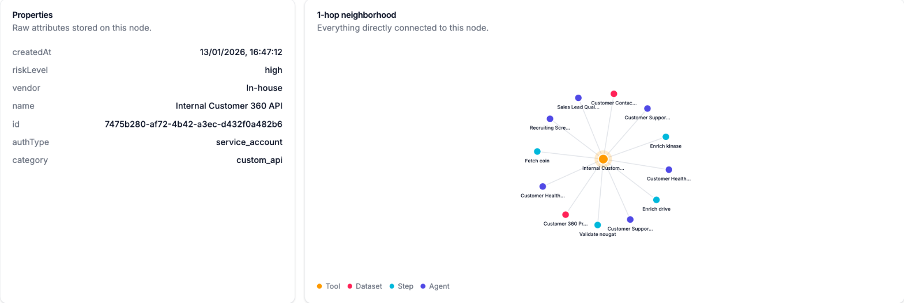

# AgentGraph

**Agentic workflow impact & lineage intelligence — backed by [CognoDB](https://console.cognodb.com), a managed graph database.**

AgentGraph models a company's AI agents, the tools they call (Slack, Jira, Salesforce, internal APIs, …), the multi-step workflows those agents run, and the datasets that flow through them — as a graph. It answers the questions that actually matter once an org has more than a handful of automations running: *if this integration goes down, what breaks? Which agents can reach PII, however indirectly? What's this agent's real data lineage?*

> Take-home assignment for Wexa AI. Built as a pnpm monorepo: NestJS + Zod + TypeORM API, TanStack Start + TanStack Query + shadcn/ui + Framer Motion frontend, CognoDB (Neo4j-protocol-compatible) as the graph store, Postgres for app metadata, Redis/BullMQ for background analysis jobs.

---

## Contents

- [Why a graph database?](#why-a-graph-database)
- [The data model](#the-data-model)
- [Architecture](#architecture)
- [Setup](#setup)
- [The queries, explained](#the-queries-explained)
- [Project structure](#project-structure)
- [Screenshots](#screenshots)

---

## Why a graph database?

The interesting questions in this domain are all about **paths and reachability through many-to-many relationships**, not rows:

- **"If this Tool goes down, what breaks?"** — an Agent can use a Tool directly, or a Workflow can call it three steps deep. Answering this in SQL means recursively joining `agents ⋈ agent_tools ⋈ tools`, `steps ⋈ step_tools`, `workflows ⋈ steps`, `agents ⋈ workflows` — a different shape of join per hop, with no fixed depth. In Cypher it's one variable-length pattern: `(tool)<-[:USES_TOOL|CALLS_TOOL|HAS_STEP*1..4]-(affected)`.
- **"Which agents can reach PII data, however indirectly?"** — transitive reachability through a chain of relationship *types* (an agent uses a tool, which writes to a dataset; or a workflow's step calls a tool that reads a different dataset). This is exactly what a relational engine is bad at: unbounded-depth traversal needs a recursive CTE per query, re-written whenever the relationship shape changes. It's a native graph pattern match here.
- **"Which agents are similar to this one?"** (by shared tool usage) — a self-join through a many-to-many bridge table (`agent_tools`), grouped and normalized. Doable in SQL, but the query reads like a graph traversal even when written in SQL — because it *is* one.
- **Data lineage** (dataset → tool → step → workflow → agent) is a fixed 4-hop chain across four differently-shaped relationships. One `MATCH` pattern in Cypher; four sequential joins (or a recursive CTE, if step ordering is dynamic) in SQL.

None of this is artificial — it's the actual shape of an agent/tool/workflow dependency graph. A relational schema *can* represent it (foreign keys), but every one of the queries above degrades from "one pattern" to "N joins, where N depends on how deep the incident goes" — which is precisely the class of problem graph databases exist to solve.

## The data model



| Label | Key properties |
|---|---|
| `Person` | name, email, team, title |
| `Agent` | name, role, status, autonomyLevel |
| `Tool` | name, vendor, category, authType, riskLevel |
| `Workflow` | name, trigger, status |
| `Step` | name, type (action/condition/loop/approval), order |
| `Dataset` | name, system, sensitivity (public/internal/confidential/**pii**) |
| `Execution` | status, startedAt, finishedAt, durationMs |

Relationship properties: `USES_TOOL.criticality` (core/optional), `EXECUTES.role` (primary/fallback), `TOUCHED.access` (read/write), etc. Full Zod schemas — the single source of truth for every node and relationship shape — live in [`packages/graph-schema`](./packages/graph-schema).

Seed data (`pnpm seed`) generates ~22 people, ~32 agents across 20 realistic roles, a fixed catalog of 26 tools (Slack, Salesforce, Jira, Stripe, Okta, Snowflake, …) and 20 datasets with an intentional sensitivity mix, ~40 workflows with 3–6 step chains each, and ~260 executions — a few thousand nodes/relationships total, comfortably inside CognoDB's free-tier limits while still producing non-trivial traversal results.

## Architecture

```
apps/
  api/    NestJS — Cypher via the official neo4j-driver, Postgres via TypeORM, BullMQ jobs
  web/    TanStack Start (React, SSR) — TanStack Query, shadcn/ui, Framer Motion
packages/
  graph-schema/   Zod schemas + TS types for every node/relationship — shared by api, web, seed
  graph-client/   Thin wrapper over neo4j-driver: parameterized queries only, connection lifecycle,
                  result mapping (Neo4j Node/Relationship/Path → plain DTOs), schema/constraints
```

**Why three data stores?** The graph (CognoDB/Neo4j) is the domain's source of truth — every Agent/Tool/Workflow/Dataset relationship lives there. Postgres (via TypeORM) holds *app-side* metadata that isn't part of the domain graph: saved analysis views (bookmarked queries a non-technical user can revisit). Redis/BullMQ runs the one genuinely expensive computation — all-pairs agent similarity across the whole graph (O(n²)) — as a background job instead of blocking a request, with the frontend polling job status through queued → running → complete.

**Engineering details worth walking through:**
- Every Cypher query is parameterized (`$param`) via the official `neo4j-driver`; see [`apps/api/src/analysis/analysis.queries.ts`](./apps/api/src/analysis/analysis.queries.ts) for the one documented exception (variable-length hop *bounds*, which Cypher requires as literal integers — Zod-validated to a `[1,6]` integer range before interpolation, never raw user input).
- `GraphExceptionFilter` maps an unreachable database to a `503` and a failed query to a `500`, instead of the API crashing or leaking a stack trace — the frontend shows a clear "couldn't load this" state either way.
- Zod schemas double as request-DTO validation (`ZodValidationPipe`) *and* the frontend's type source — one schema, no drift between what the API accepts and what the UI sends.

## Setup

### Prerequisites

- Node.js ≥ 20, [pnpm](https://pnpm.io) ≥ 9
- Docker (for local Neo4j/Postgres/Redis — see below)

### 1. Get a CognoDB instance (for the real deployment)

1. Sign up at [console.cognodb.com/signup](https://console.cognodb.com/signup) (no card required for the free tier).
2. Create a free **c0** instance, pick a region. Provisions in under a minute.
3. Copy the `bolt+s://<instance-id>.databases.cognodb.cloud` URI and the generated password for user `cognodb` — **the password is shown once**.

### 2. Local development (no CognoDB account needed)

CognoDB has no self-hostable image — it's cloud-only — but it speaks the same Bolt/Cypher wire protocol as Neo4j, so Neo4j is a drop-in local stand-in. This is why the app is runnable end-to-end without any external account:

```bash
git clone <this-repo>
cd graphdb
cp .env.example .env          # defaults already point at the docker-compose services below
docker compose up -d          # Neo4j (bolt://localhost:7687), Postgres, Redis
pnpm install
pnpm seed                     # loads realistic demo data into the graph
pnpm dev                      # API on :3001, web app on :3000
```

Open **http://localhost:3000**.

### 3. Pointing at real CognoDB Cloud

Edit `.env`:

```bash
GRAPH_URI=bolt+s://<instance-id>.databases.cognodb.cloud
GRAPH_USER=cognodb
GRAPH_PASSWORD=<the password you saved>
GRAPH_DATABASE=neo4j
```

No code changes — `pnpm seed && pnpm dev` again. The official `neo4j-driver` (used throughout `packages/graph-client`) connects to CognoDB unchanged.

### Useful scripts

| Command | What it does |
|---|---|
| `pnpm dev` | Runs the API and web app together (via Turborepo) |
| `pnpm seed` | Loads seed data (idempotent — adds on top of existing data) |
| `pnpm seed:reset` | Wipes the graph first, then reseeds |
| `pnpm build` | Builds every app/package |
| `pnpm typecheck` | Type-checks the whole monorepo |

## The queries, explained

All Cypher lives in [`apps/api/src/analysis/analysis.queries.ts`](./apps/api/src/analysis/analysis.queries.ts).

**1. Impact analysis (multi-hop, variable length)** — `/analysis/impact?nodeId=&maxHops=`
```cypher
MATCH (start {id: $nodeId})
MATCH path = (start)-[:USES_TOOL|EXECUTES|HAS_STEP|CALLS_TOOL|DEPENDS_ON|NEXT*1..N]-(affected)
WHERE (affected:Agent OR affected:Workflow) AND affected.id <> $nodeId
```
Blast radius from a failing Tool or Workflow: every Agent/Workflow within N hops, ranked by shortest distance.

**2. Data lineage (fixed 4-hop)** — `/analysis/lineage?datasetId=`
```cypher
MATCH path = (d:Dataset {id: $datasetId})<-[:READS_FROM|WRITES_TO]-(:Tool)
             <-[:CALLS_TOOL]-(:Step)<-[:HAS_STEP]-(:Workflow)<-[:EXECUTES]-(:Agent)
```
Everything that can produce or consume a dataset, traced back through the tool/step/workflow chain to the responsible agents.

**3. Agent similarity (the "awkward in SQL" one)** — `/analysis/similar-agents?agentId=`
```cypher
MATCH (a:Agent {id: $agentId})-[:USES_TOOL]->(t:Tool)
WITH a, collect(DISTINCT t) AS aTools, count(DISTINCT t) AS aToolCount
MATCH (other:Agent)-[:USES_TOOL]->(t2:Tool)
WHERE other.id <> a.id AND t2 IN aTools
WITH other, aToolCount, collect(DISTINCT t2.name) AS sharedToolNames, count(DISTINCT t2) AS sharedTools
RETURN other, sharedToolNames, sharedTools, toFloat(sharedTools) / aToolCount AS score
```
A Jaccard-style recommendation by shared tool usage.

**4. Sensitive-data exposure** — `/analysis/exposure?sensitivity=pii`
```cypher
MATCH (a:Agent), (d:Dataset {sensitivity: $sensitivity})
MATCH path = shortestPath((a)-[:USES_TOOL|EXECUTES|HAS_STEP|CALLS_TOOL|READS_FROM|WRITES_TO*1..6]-(d))
```
Every agent that can transitively reach PII/confidential data, with the shortest path shown — a governance question that's pure reachability.

**5. Execution trace** — `/analysis/executions/:id/trace` — which agent triggered a run, which workflow it ran, and which datasets it touched, with read/write access.

## Project structure

```
graphdb/
├── apps/
│   ├── api/                  NestJS API
│   │   └── src/
│   │       ├── analysis/     the 5 graph-native queries above
│   │       ├── catalog/      generic list/detail over any node label
│   │       ├── graph/        GraphService — GraphClient lifecycle, health
│   │       ├── jobs/         BullMQ: async similarity leaderboard
│   │       ├── views/        Postgres/TypeORM: saved analysis views
│   │       ├── health/       aggregate graph+postgres+redis health
│   │       ├── config/       Zod-validated env config
│   │       └── seed/         seed data generator + batched graph loader
│   └── web/                  TanStack Start frontend
│       └── src/
│           ├── routes/       one file per page (file-based routing)
│           ├── components/   ui/ (shadcn primitives), graph/ (force-directed SVG viz), layout/
│           └── hooks/        TanStack Query hooks, one per API area
├── packages/
│   ├── graph-schema/         Zod schemas + TS types (the domain model)
│   └── graph-client/         neo4j-driver wrapper — the only file importing it directly
└── docker-compose.yml        local Neo4j + Postgres + Redis
```

## Screenshots

| | |
|---|---|
|  Dashboard |  Sensitive-data exposure |
|  Similar agents |  Similarity leaderboard (async job) |
|  Node detail — 1-hop neighborhood graph | |

## Demo

- **Hosted app:** _TODO — add link_
- **Screen recording:** _TODO — add link_
